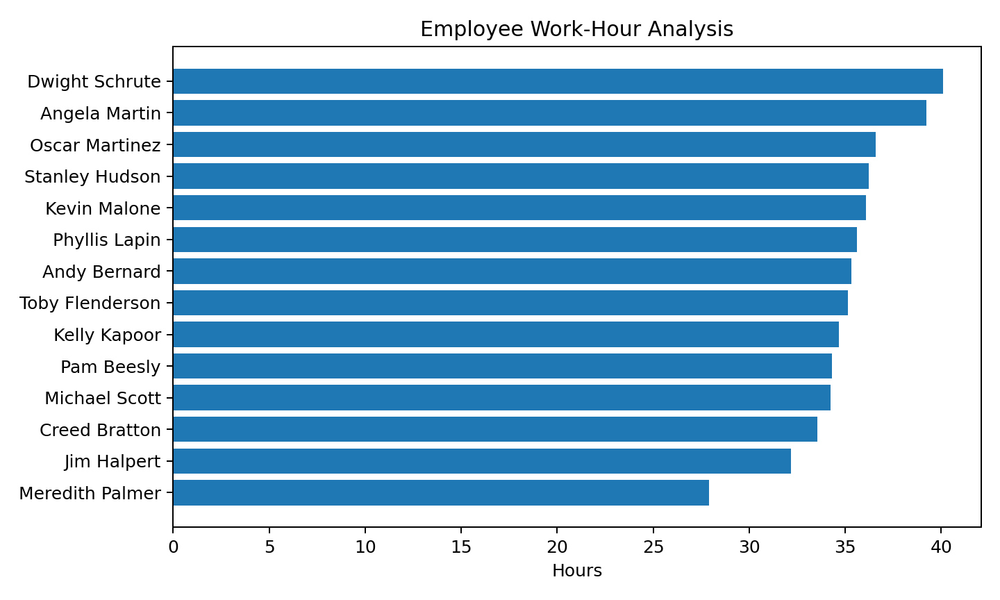
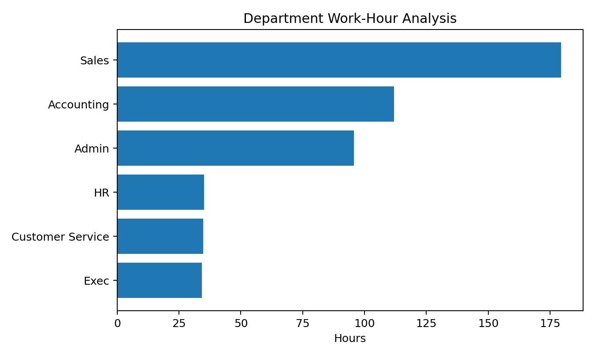
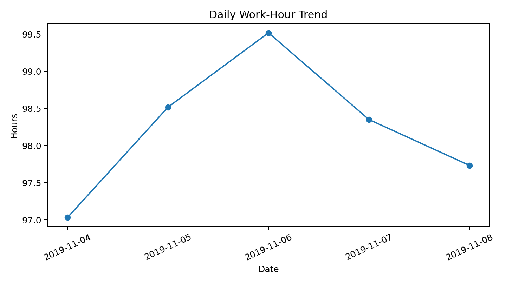

# dunder-mifflin-attendance-analytics
Employee Attendance Analytics project using Excel, SQL and Power BI

# Dunder Mifflin Attendance Analytics

## 📊 Project Overview

Dunder Mifflin Attendance Analytics is an employee attendance and work-hours analysis project built using Excel, SQL, and Power BI.

The project analyzes employee attendance records to understand work hours, breaks, department performance, daily trends, and attendance exceptions.

## 🎯 Business Problem

Organizations need to monitor employee attendance and working hours to identify:

- Employee work-hour patterns
- Department-level performance
- Break patterns
- Attendance consistency
- Potential low-work-hour days
- Late arrivals and attendance exceptions

This project converts raw attendance events into meaningful business insights.

## 🛠️ Tools & Technologies

- Microsoft Excel
- SQL
- Power BI
- Data Cleaning
- Data Analysis
- Data Visualization

## 📁 Project Structure

```text
dunder-mifflin-attendance-analytics/
│
├── README.md
│
├── data/
│   └── attendance_data.xls
│
├── excel/
│   └── Attendance_Analytics_Interview.xlsx
│
├── sql/
│   └── attendance_analysis.sql
│
├── report/
│   └── Dunder_Mifflin_Attendance_Project_Report.pdf
│
├── images/
│   ├── employee_hours.png
│   ├── department_hours.png
│   └── daily_trend.png
│
└── powerbi/
    └── Dunder_Mifflin_Attendance_Analytics.pbix
```

## Dataset Summary

Metric                       Value
Total Employees              14
Departments                  6
Working Days                 5
Employee-Day Records         70
Total Work Hours             491.15
Average Work Hours /
Employee-Day                 ~7.02
Attendance Completion        100%
Late Arrivals                0

## Key Questions

The analysis answers questions such as:
How many employees are included in the dataset?
How many hours did each employee work?
Which departments recorded the most work hours?
What are the daily work-hour trends?
How many attendance days were recorded for each employee?
Were there any late arrivals?
Were there employee-days with unusually low work hours?

## Key KPIs

Total Employees
Total Departments
Total Work Hours
Average Work Hours
Average Break Hours
Attendance Days
Attendance Completion %
Late Arrivals
Low Work-Hour Days

## Visualizations








## Analysis Workflow


Raw Attendance Data
        ↓
Data Cleaning
        ↓
Employee-Day Transformation
        ↓
Excel Analysis
        ↓
SQL Analysis
        ↓
Power BI Dashboard
        ↓
Business Insights


## Methodology

The raw attendance data contains employee In/Out events.
These events were transformed into employee-day level records containing:
First In time
Last Out time
Work Hours
Break Hours
Department
Late Arrival indicator
This employee-day dataset was then used for Excel analysis, SQL queries, and Power BI dashboard development.


## Business Insights

The dataset contains 14 employees across 6 departments.
A total of 491.15 work hours were recorded.
Average recorded work time was approximately 7.02 hours per employee-day.
Attendance records were complete for all employee-day combinations in the analyzed period.
No first-in events occurred after 9:00 AM based on the defined late-arrival rule.
Department and employee-level analysis helps identify differences in recorded work hours.


## Dataset Limitation

This is a small sample attendance dataset covering 5 working days and should not be treated as a long-term representation of employee performance.
The project is intended for learning, portfolio development, and demonstration of data analytics skills.


## Skills Demonstrated

Data Cleaning
Excel Data Analysis
SQL Querying
KPI Development
Data Transformation
Business Analysis
Data Visualization
Dashboard Design
Power BI
GitHub Project Documentation


## Portfolio Project

This project demonstrates practical data analytics skills and is designed as a portfolio project for entry-level Data Analyst opportunities.
